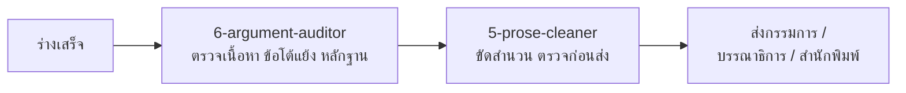

# 🤖 AcademicForward — AI Agent & Knowledge Framework Hub

ศูนย์รวมสถาปัตยกรรม AI Agent และเครื่องมือส่งเสริมการศึกษา งานวิจัย และการสนับสนุนการทำงานวิชาการ (มรนว. 2568 / APA 7th Edition / มาตรฐาน อว. 2567)

[](https://github.com/X66CLRF/academicforward/releases/tag/v6.0)
[](Writing/nsru-2568-manual-reference.md)
[](https://github.com/X66CLRF/academicforward/releases/tag/v6.0)
[](#)

---

## 🧭 เลือกใช้งานตาม Action ที่คุณต้องการทำ (หยิบไฟล์เดียวจบ 100%):

```text
academicforward/
├── ✍️ Writing/       # สกิลสำหรับ "เขียน" (ป.ตรี, ป.โท/เอก, นักวิจัย, ผู้เขียนตำรา — เลือกไฟล์ 1-4 ไฟล์เดียวจบ + ไฟล์ 6 ตรวจเนื้อหา และไฟล์ 5 ขัดภาษา)
├── 🎨 Designing/     # สกิลสำหรับ "ออกแบบ" (สไลด์การสอน, โครงสร้างตำรา, ไดอะแกรม Flowchart, ผังกระบวนการ WP/WI)
├── 🔍 Searching/     # สกิลสำหรับ "สืบค้น" (คลังคำค้นหาฐานข้อมูลไทย-เทศ, พรอมท์สืบค้น)
├── 📋 Evaluation/    # สกิลสำหรับ "ขอตำแหน่งสูงขึ้น" (เอกสารประเมินสายสนับสนุน + สคริปต์ .docx + เทมเพลตตารางหลักฐาน)
├── 📢 Publishing/    # สกิลสำหรับ "เผยแพร่ & โพสต์" (แต่งโพสต์ Facebook/Social ARITC NSRU)
└── 💻 Automation/    # สกิลสำหรับ "จัดการไฟล์ & สนับสนุนงาน" (สร้างไฟล์ Word ใหม่, แก้ .docx โดยฟอร์แมตไม่พัง, ล็อกสิทธิ์ GDrive)
```

---

## 📊 ตารางเวอร์ชันและลิงก์ดาวน์โหลดตรง (Master Release Matrix v6.0)

| Action | ไฟล์ / ชุดเครื่องมือ | เวอร์ชัน | กลุ่มเป้าหมาย & ฟังก์ชันหลัก | 📥 ลิงก์ดาวน์โหลดตรง (Direct Download) |
| :--- | :--- | :---: | :--- | :---: |
| ✍️ **Writing** | [Writing/1-undergrad-research.md](Writing/1-undergrad-research.md) | `v6.0` | 🎓 **นักศึกษา ป.ตรี** — รายงานวิจัย 5 บท + โครงสร้าง 4 ส่วน + บรรณานุกรมในตัว | [📥 ดาวน์โหลด .md](https://github.com/X66CLRF/academicforward/releases/download/v6.0/1-undergrad-research.md) |
| ✍️ **Writing** | [Writing/2-grad-research.md](Writing/2-grad-research.md) | `v6.0` | 🔬 **นักศึกษา ป.โท/เอก** — Thesis / IS / Proposal + Thematic Synthesis + closed-world | [📥 ดาวน์โหลด .md](https://github.com/X66CLRF/academicforward/releases/download/v6.0/2-grad-research.md) |
| ✍️ **Writing** | [Writing/3-researcher-manuscript.md](Writing/3-researcher-manuscript.md) | `v6.0` | 🧪 **อาจารย์ / นักวิจัย** — ตรวจ Reviewer (🔴/🟡/🟢) + ยกร่าง IMRaD + Synthesis Matrix | [📥 ดาวน์โหลด .md](https://github.com/X66CLRF/academicforward/releases/download/v6.0/3-researcher-manuscript.md) |
| ✍️ **Writing** | [Writing/4-textbook-writer.md](Writing/4-textbook-writer.md) | `v6.1` | ✍️ **คณาจารย์ผู้เขียนตำรา** — เขียนตำรา + โครงภาพเวกเตอร์ + คุมเลนส์ตำราชุด + ภาคผนวก ก | [📥 ดาวน์โหลด .md](https://github.com/X66CLRF/academicforward/releases/download/v6.0/4-textbook-writer.md) |
| ✍️ **Writing** | [Writing/5-prose-cleaner.md](Writing/5-prose-cleaner.md) | `v1.0` | 🧼 **ทุกคนที่มีร่างอยู่แล้ว** — ขัดสำนวนแปล + ด่านศัพท์เฉพาะ + กวาดศัพท์ทั้งเล่ม + ด่านตรวจก่อนส่ง | [📖 เปิดไฟล์](Writing/5-prose-cleaner.md) |
| ✍️ **Writing** | [Writing/6-argument-auditor.md](Writing/6-argument-auditor.md) | `v1.0` | 🧠 **ทุกคนที่มีร่างครบแล้ว** — แผนผังข้ออ้าง–หลักฐาน + ช่องว่างงานวิจัย + เส้นเชื่อมวัตถุประสงค์–ผล–อภิปราย + ด่านอ้างเกิน (ใช้ **ก่อน** ไฟล์ 5) | [📖 เปิดไฟล์](Writing/6-argument-auditor.md) |
| 📖 **Reference** | [Writing/nsru-2568-manual-reference.md](Writing/nsru-2568-manual-reference.md) | `v5.6` | 📌 **คู่มืออ้างอิงกลาง** — กฎวิจัย มรนว. 2568 ฉบับเต็ม (สำหรับเปิดอ่าน ไม่ต้องอัปโหลด) | [📖 เปิดอ่านคู่มือ](Writing/nsru-2568-manual-reference.md) |
| 📖 **Reference** | [Writing/thai-academic-language-guard.md](Writing/thai-academic-language-guard.md) | `v1.0` | 🧬 **คู่มือภาษาไทยวิชาการต้นฉบับ** — ตารางกับดักคำแปล + กฎวงเล็บอังกฤษ + ด่านคุมความซ้ำ | [📖 เปิดอ่านคู่มือ](Writing/thai-academic-language-guard.md) |
| 📖 **Reference** | [Writing/writing-development-research-brief.md](Writing/writing-development-research-brief.md) | `2026-08-31` | 🔬 **บันทึกรีเสิร์ชเบื้องหลังกฎชุดเขียน** — ความแม่นยำเครื่องตรวจ AI + นโยบายวารสาร/สำนักพิมพ์ + หลักฐานพัฒนางานเขียน (ระบุระดับความเชื่อถือรายข้อ) | [📖 เปิดอ่านบันทึก](Writing/writing-development-research-brief.md) |
| 🎨 **Designing** | [Designing/slide-hub-agent.md](Designing/slide-hub-agent.md) | `v2.0` | 🚀 **อาจารย์ / ผู้สอน** — ออกแบบสไลด์ 16:9 + บอร์ดเกม + ใบงาน A4 | [📖 เปิดไฟล์](Designing/slide-hub-agent.md) |
| 🎨 **Designing** | [Designing/textbook-structure-agent.md](Designing/textbook-structure-agent.md) | `v1.6` | 🗂️ **ผู้พัฒนาหลักสูตร** — วางโครงสร้างเล่มตำรา & CLO & คีย์เวิร์ด | [📖 เปิดไฟล์](Designing/textbook-structure-agent.md) |
| 🎨 **Designing** | [Designing/flowchart-diagram-agent.md](Designing/flowchart-diagram-agent.md) | `v3.1` | 📊 **ทุกกลุ่ม** — Flowchart / Diagram / Architecture + กรอบแนวคิดวิจัย + PRISMA + กติกา ISO 5807 + render ด้วย `mmdc` | [📖 เปิดไฟล์](Designing/flowchart-diagram-agent.md) |
| 🎨 **Designing** | [Designing/wp-wi-flowchart-agent.md](Designing/wp-wi-flowchart-agent.md) | `v1.0` | 🏛️ **สายสนับสนุน / งานประกันคุณภาพ** — ผังกระบวนการชุด WP/WI/SOP + กฎผังตรงกับตารางขั้นตอน + เช็คลิสต์ปิดชุด ๑๐ ข้อ (เปิดคู่ `flowchart-diagram-agent`) | [📖 เปิดไฟล์](Designing/wp-wi-flowchart-agent.md) |
| 🎨 **Designing** | [Designing/textbook-figure-agent.md](Designing/textbook-figure-agent.md) | `v2.0` | 🖼️ **คณาจารย์ผู้เขียนตำรา** — ผลิตภาพประกอบเวกเตอร์ภาษาไทยทั้งเล่ม + แทรกลง Word + ภาคผนวก ก | [📖 เปิดไฟล์](Designing/textbook-figure-agent.md) |
| 🔍 **Searching** | [Searching/academic-search-keywords.md](Searching/academic-search-keywords.md) | `v2.0` | 🔍 **นักศึกษา / นักวิจัย** — คลังสะพานคำค้นภาษาไทย ↔ อังกฤษ 12 ฐานข้อมูล | [📖 เปิดไฟล์](Searching/academic-search-keywords.md) |
| 🔍 **Searching** | [Searching/academic-database-prompts.md](Searching/academic-database-prompts.md) | `v2.0` | 💡 **นักศึกษา / อาจารย์** — ชุดคำสั่ง Prompt สกัดความรู้และสรุปเปเปอร์ | [📖 เปิดไฟล์](Searching/academic-database-prompts.md) |
| 📋 **Evaluation** | [Evaluation/promote-doc-agent.md](Evaluation/promote-doc-agent.md) | `v1.0` | 📋 **บุคลากรสายสนับสนุน (ชำนาญการ / ชำนาญการพิเศษ)** — ถ้อยคำเกณฑ์ ๑๒ สมรรถนะ × ๕ ระดับ + จับคู่หลักฐาน + ออกเลขเอกสารแนบ + เช็คลิสต์ปิดเล่ม | [📖 เปิดไฟล์](Evaluation/promote-doc-agent.md) |
| 📢 **Publishing** | [Publishing/aritc-social-post-agent.md](Publishing/aritc-social-post-agent.md) | `v2.0` | 📱 **เจ้าหน้าที่ / ประชาสัมพันธ์** — แต่งโพสต์ Facebook สื่อสารองค์กร ARITC NSRU | [📖 เปิดไฟล์](Publishing/aritc-social-post-agent.md) |
| 💻 **Automation** | [Automation/docx-builder.md](Automation/docx-builder.md) | `v1.0` | 🧱 **ทุกคนที่ให้ AI ผลิตไฟล์ Word ใหม่** — ตั้งสไตล์แทนการจัดรูปแบบโดยตรง + แก้บั๊กอักษรเชิงซ้อนของภาษาไทย + มาตรฐานตาราง + ด่านตรวจก่อนส่งมอบ | [📖 เปิดไฟล์](Automation/docx-builder.md) |
| 🐍 **Automation** | [Automation/scripts/](Automation/scripts/) | `v1.0` | 🧰 **ไลบรารีกลางสร้างไฟล์ Word** — `docx_core.py` ตัวสร้างเอกสารพร้อมสไตล์และตาราง · `check_docx.py` ด่านตรวจ 9 ข้อ · `example_report.py` ตัวอย่างพร้อมก๊อปไปแก้ | [📖 เปิดโฟลเดอร์](Automation/scripts/) |
| 💻 **Automation** | [Automation/docx-safe-edit-agent.md](Automation/docx-safe-edit-agent.md) | `v1.0` | 🧬 **ทุกคนที่ต้องแก้ไฟล์ .docx ที่จัดรูปแบบแล้ว** — แทนที่ข้อความโดยฟอร์แมตไม่พัง + backup อัตโนมัติ + แทนรูปคงเฟรม/สัดส่วน + ยืมเล่มคนอื่นเป็นเทมเพลท | [📖 เปิดไฟล์](Automation/docx-safe-edit-agent.md) |
| 🔒 **Automation** | [Automation/gdrive-permission-agent.md](Automation/gdrive-permission-agent.md) | `v2.0` | 🔒 **อาจารย์ / เจ้าหน้าที่** — สคริปต์ควบคุมสิทธิ์ดาวน์โหลดไฟล์ Google Drive | [📖 เปิดไฟล์](Automation/gdrive-permission-agent.md) |

---

## 🔗 คอมโบสกิล — หยิบไฟล์ไหนต่อไฟล์ไหน

> สกิลแต่ละไฟล์ทำงานเดี่ยวได้ครบในตัว แต่ **งานจริงมักเป็นสายยาว** ตารางนี้บอกลำดับที่ใช้ได้ผลจริง หยิบเฉพาะขั้นที่ต้องใช้ก็ได้ ไม่ต้องครบสาย

| # | คอมโบ | ลำดับการหยิบไฟล์ |
| :---: | :--- | :--- |
| 1 | 🎓 **วิจัย ป.ตรี / ป.โท-เอก** | `academic-search-keywords` → `academic-database-prompts` → **`1-undergrad-research`** หรือ **`2-grad-research`** → `6-argument-auditor` → `5-prose-cleaner` → `flowchart-diagram-agent` (กรอบแนวคิด/ผังขั้นตอน) |
| 2 | 🧪 **บทความตีพิมพ์วารสาร** | `academic-search-keywords` → **`3-researcher-manuscript`** → `6-argument-auditor` → `5-prose-cleaner` |
| 3 | ✍️ **เขียนตำรา (สายยาวสุด)** | `textbook-structure-agent` → **`4-textbook-writer`** → `textbook-figure-agent` → **`docx-builder`** (สร้างไฟล์เล่มขึ้นใหม่) หรือ `docx-safe-edit-agent` (แก้เล่มเดิมโดยฟอร์แมตไม่พัง) → `6-argument-auditor` → `5-prose-cleaner` |
| 4 | 📋 **ขอกำหนดตำแหน่งสูงขึ้น** | **`promote-doc-agent`** + `docx-safe-edit-agent` (กลไกแก้ไฟล์ + ยืมเล่มเป็นเทมเพลท) → `5-prose-cleaner` (ขัดสำนวนช่องบันทึกร่องรอยคุณภาพ) |
| 5 | 🎮 **สอน / นำเสนอ** | `textbook-structure-agent` (โครงเนื้อหา) → **`slide-hub-agent`** → `flowchart-diagram-agent` |
| 6 | 📢 **เผยแพร่ผลงาน** | ผลงานจากคอมโบ 1–4 → **`aritc-social-post-agent`** → `gdrive-permission-agent` (ล็อกสิทธิ์ไฟล์ที่แจก) |
| 7 | 🏛️ **ทำ/แก้ชุดเอกสารคุณภาพ JD-WP-WI** | **`wp-wi-flowchart-agent`** + `flowchart-diagram-agent` (เปิดคู่ วาดผังทั้งชุด) → `docx-safe-edit-agent` (แก้ถ้อยคำในเล่ม + แทนรูปผัง) → `promote-doc-agent` (ถ้าใช้เป็นหลักฐานขอตำแหน่ง) |

### 🧭 ลำดับด่านตรวจ — ห้ามสลับ



**ตรวจเนื้อหาก่อน แล้วค่อยเกลาภาษาเสมอ** เพราะการเกลาภาษาย่อหน้าที่สุดท้ายต้องเขียนใหม่ทั้งย่อหน้าคือการเสียเวลาเปล่า

### 🧬 สำนวนแปลถูกจับ 3 ชั้น — ผ่านชั้นบนแล้วยังตกชั้นล่างได้

> ปัญหา "แปลตรงตัว" กับ "อ่านเหมือนเอกสารต่างประเทศ" ไม่ได้อยู่ที่ระดับเดียว
> เอเจนต์ต้องรู้ว่ากำลังแก้ชั้นไหน เพราะวิธีแก้คนละแบบ และต้องแก้ตามลำดับ

| ชั้น | จับที่ | ตัวอย่างที่จับได้ | อ่านกฎที่ | ตรวจจริงที่ |
| :---: | :--- | :--- | :--- | :--- |
| 1 | **คำ** | `ความถูกต้อง` ที่ควรเป็น `ความตรง` | `thai-academic-language-guard` ข้อ 2 | `5-prose-cleaner` ด้านที่ 2 |
| 2 | **โครงประโยค** | `การเพิ่มขึ้นของจำนวนของ…` · `ถูกกำหนดโดย…` · `สามารถ…ได้` ทุกประโยค | ข้อ 12 | ด้านที่ 8 |
| 3 | **คู่คำ** | `อุปสงค์ที่ร้อนแรงเกินไป` · `ตัวเลขเล่าเรื่อง` — คำไทยแท้ทุกคำ โครงไทยทุกประโยค แต่ไทยไม่เข้าคู่กันแบบนี้ | ข้อ 17 | ด้านที่ 9 |

**เมื่อจะเขียนใหม่** ให้เปิด **คลังรูปประโยคไทยวิชาการ** (ข้อ 13) แล้วเลือกรูปประโยคตาม *หน้าที่* ของย่อหน้า
🔴 **ห้ามเริ่มจากประโยคภาษาอังกฤษแล้วย้อนหาคู่คำไทย** นั่นคือกลไกที่ผลิตสำนวนแปลตั้งแต่ต้นทาง

**เมื่อหยิบสาระจากตำราหรือคู่มือภาษาอังกฤษ** ให้ใช้ข้อ 14 — รับ **วินัยการคิด** (ทุกข้ออ้างต้องมีหลักฐาน หนึ่งย่อหน้าหนึ่งความคิด)
ปฏิเสธ **แม่แบบภาษา** (Topic Sentence · ตารางคำเชื่อมแปลตรงตัว · โซ่ Firstly–Additionally–Finally)

**งานที่มีภาพและตาราง** ต้องผ่าน **ด่านศัพท์ข้ามสื่อ** (ข้อ 16) ก่อนส่งสเปกให้ `textbook-figure-agent` ทุกครั้ง


### 🗺️ ตารางเจ้าของเรื่อง — เรื่องไหนอยู่ไฟล์ไหน

> ทำขึ้นหลังพบว่าบางเรื่อง **ไม่มีไฟล์ไหนเป็นเจ้าของ** งานจึงตกพื้น แล้วเอเจนต์เดาเอง
> ก่อนตอบเรื่องใด ให้เช็คตารางนี้ก่อนว่าเป็นของไฟล์ไหน ถ้าไม่ใช่ของตัวเอง **ให้ชี้ทาง ไม่ใช่ตอบเอง**

| เรื่อง | เจ้าของ | หมายเหตุ |
| :--- | :--- | :--- |
| เนื้อหาและสำนวนของงานเขียน | ไฟล์สายเขียน 1-4 ตามประเภทงาน | — |
| ตรวจข้อโต้แย้งและหลักฐาน | `6-argument-auditor` | ใช้**ก่อน** ไฟล์ 5 เสมอ |
| ขัดสำนวนและศัพท์เฉพาะ | `5-prose-cleaner` | ใช้หลังไฟล์ 6 |
| กับดักคำแปลระดับ **คำ** · กฎวงเล็บอังกฤษ | `thai-academic-language-guard` ข้อ 2 | เปิดคู่ทุกงานเขียนภาษาไทย |
| สำนวนแปลระดับ **โครงประโยค** (`ถูกกำหนดโดย` · `การเพิ่มขึ้นของจำนวนของ`) | `thai-academic-language-guard` ข้อ 12 | ตรวจจริงด้วย `5-prose-cleaner` ด้านที่ 8 |
| สำนวนแปลระดับ **คู่คำ** (`อุปสงค์ร้อนแรง` · `ตัวเลขเล่าเรื่อง`) | `thai-academic-language-guard` ข้อ 17 | ตรวจจริงด้วย `5-prose-cleaner` ด้านที่ 9 |
| **จะเขียนไทยว่าอย่างไร** — คลังรูปประโยคตามหน้าที่ในความเรียง | `thai-academic-language-guard` ข้อ 13 | ใช้ตอน**เขียนใหม่** ห้ามแปลจากอังกฤษแล้วย้อนหาคู่คำไทย |
| หยิบสาระจาก **ตำราหรือคู่มือภาษาอังกฤษ** | `thai-academic-language-guard` ข้อ 14 | รับวินัยการคิด ปฏิเสธแม่แบบภาษา |
| **ศัพท์ในป้ายภาพและหัวตาราง** ต้องตรงกับเนื้อความ | `thai-academic-language-guard` ข้อ 16 | ตรวจ**ก่อน**ส่งสเปกให้ `textbook-figure-agent` — แก้ทีหลังต้องแก้ไฟล์เวกเตอร์ |
| เอกสารภาษาไทยแบบใดควรเอามาเติมคลัง | `thai-academic-language-guard` ข้อ 15 | บอกลำดับแหล่งและรูปแบบไฟล์ที่ใช้ได้จริง |
| กฎการอ้างอิงและบรรณานุกรม | `nsru-2568-manual-reference` | APA 7th + กฎสถาบัน |
| **สเปกการจัดรูปแบบเอกสาร** | `nsru-2568-manual-reference` | ขนาด ระยะบรรทัด เยื้อง ตาราง |
| **การผลิตไฟล์ `.docx` ใหม่** | `docx-builder` | โครงสร้างไฟล์ ไม่ใช่เนื้อหา |
| **การแก้ไฟล์ `.docx` เดิม** | `docx-safe-edit-agent` | รักษาฟอร์แมตเดิม |
| โครงสร้างเล่มและ CLO | `textbook-structure-agent` | ก่อนเริ่มเขียน |
| **ชุดสีและธีมของภาพ** | `textbook-figure-agent` | ที่เดียวเท่านั้น ไฟล์อื่นห้ามบันทึกรหัสสี |
| สเปกและการผลิตภาพประกอบ | `textbook-figure-agent` | ไฟล์สายเขียนออกสเปก ไฟล์นี้ผลิต |
| ผังกระบวนการและไดอะแกรม | `flowchart-diagram-agent` | กติกา Mermaid ทั้งหมดอยู่ที่นี่ที่เดียว |
| **ผังชุดเอกสารคุณภาพ WP/WI/SOP** | `wp-wi-flowchart-agent` | กฎเฉพาะชุดเอกสาร เปิดคู่ `flowchart-diagram-agent` เสมอ |
| **แทนรูปในไฟล์ `.docx` เดิม** | `docx-safe-edit-agent` | ไฟล์อื่นห้ามเขียนวิธีแทนรูปซ้ำ |
| คำค้นและการสืบค้นฐานข้อมูล | `academic-search-keywords` + `academic-database-prompts` | ใช้คู่กันเสมอ |
| ขอตำแหน่งสูงขึ้น **สายสนับสนุน** | `promote-doc-agent` | ๑๒ สมรรถนะ × ๕ ระดับ |

**เรื่องที่ยังไม่มีเจ้าของ** — ถ้าผู้ใช้ถามเรื่องเหล่านี้ ให้บอกตรง ๆ ว่ายังไม่มีสกิลรองรับ **ห้ามเดา**

* ขอตำแหน่งสูงขึ้น **สายวิชาการ** (ผศ./รศ.) — แบบ ก.พ.อ. 03 · เอกสารรับรองการเผยแพร่ · แบบแสดงหลักฐานการมีส่วนร่วม
* การจัดการแหล่งอ้างอิงที่ **ไม่มีไฟล์ดิจิทัล** — หนังสือเล่มจริงที่ผู้ใช้ไปอ่านมาเอง
* ปกนอก ปกใน และแบบฟอร์มรายละเอียดรายวิชาของสถาบัน — ผู้ใช้จัดเองตามแบบฟอร์ม

### 📖 ไฟล์อ้างอิงกลาง — เปิดคู่ได้ทุกคอมโบ ไม่ต้องอัปโหลด

| ไฟล์ | ใช้ตอนไหน |
| :--- | :--- |
| [`Writing/nsru-2568-manual-reference.md`](Writing/nsru-2568-manual-reference.md) | กฎรูปแบบ มรนว. 2568 + APA 7th — เปิดเทียบตอนจัดรูปเล่มและบรรณานุกรม |
| [`Writing/thai-academic-language-guard.md`](Writing/thai-academic-language-guard.md) | **คู่มือภาษาไทยวิชาการฉบับเต็ม 17 ข้อ** — กับดักคำแปล (2) · ลายนิ้วมือภาษาเครื่อง (3) · ความซ้ำ (4) · นโยบาย AI ของสำนักพิมพ์ (8) · น้ำเสียงตำราและภาษาพูด (9) · **ด่านโครงสร้างประโยค (12)** · **คลังรูปประโยคไทย (13)** · **กฎใช้คู่มือต่างประเทศ (14)** · คลังต้นแบบภาษาไทย (15) · **ด่านศัพท์ข้ามสื่อ (16)** · **ด่านคำเข้าคู่ (17)** — เปิดคู่ทุกงานเขียนภาษาไทย |
| [`Writing/writing-development-research-brief.md`](Writing/writing-development-research-brief.md) | บันทึกรีเสิร์ชเบื้องหลังกฎในชุดเขียน — เปิดเมื่ออยากรู้ว่ากฎข้อไหนมาจากหลักฐานอะไร และเชื่อถือได้แค่ไหน |
| [`Automation/docx-builder.md`](Automation/docx-builder.md) | เมื่อต้องให้ AI **สร้าง** ไฟล์ `.docx` ขึ้นใหม่ — ด่านตั้งสเปกและด่านตรวจก่อนส่งมอบ |
| [`Automation/docx-safe-edit-agent.md`](Automation/docx-safe-edit-agent.md) | เมื่อถึงขั้น **แก้** ไฟล์ `.docx` ที่จัดรูปแบบไว้แล้ว — ทุกคอมโบที่ส่งงานเป็นไฟล์ Word |

---

## 🛡️ จริยธรรมและความถูกต้องทางวิชาการ (Academic & Ethical Integrity)
ทุก Agent ในคลังนี้ถูกออกแบบตามแนวปฏิบัติของ **กระทรวง อว. (2567)** และ **COPE (Committee on Publication Ethics)**:
1. **Strict Closed-World Guardrail:** สังเคราะห์เนื้อหาจากเอกสารจริงในคลัง (NotebookLM / PDF) ห้ามกุชื่อหรืออ้างอิงปลอม 100%
2. **Anti-Fabrication:** ห้ามสร้างข้อมูลหรือผลสถิติเท็จ ผู้วิจัยเป็นผู้เก็บข้อมูลและรันสถิติจริง AI มีหน้าที่ช่วยแปลผลตารางตามมาตรฐาน APA 7th
3. **No Plagiarism / Text-Spinning:** มุ่งเน้นการสังเคราะห์เชิงวิพากษ์ (Critical Synthesis) ไม่สนับสนุนการตัดแปะเพื่อเลี่ยงการตรวจจับ
4. **No Detector Evasion / No Score Promise:** ไม่มีเทคนิคหลบเครื่องตรวจในคลังนี้ (โยกคำ สลับคำ แทนอักขระ ปั่นคำ) เพราะจัดอยู่ในกลุ่ม AI-bypassed ที่เครื่องตรวจแยกจับไว้เป็นหมวดเฉพาะ และห้ามรับปากตัวเลขผลตรวจทุกกรณี

---

## 🚀 วิธีใช้งานด่วน (3 ขั้นตอนง่ายๆ):
1. **คลิกลิงก์ดาวน์โหลดตรง** ในตารางด้านบน เพื่อเซฟไฟล์ `.md` ลงเครื่อง
2. **อัปโหลดไฟล์ `.md` เพียงไฟล์เดียว** เข้าสู่ Claude / ChatGPT / Gemini
3. **เริ่มใช้งานได้ทันที!** โดยเลือกกดหมายเลขเมนู หรือพิมพ์เล่าความต้องการเป็นภาษาพูดธรรมดา

---

> *อัปเดตล่าสุด: 2 กันยายน 2569 | Repository: [https://github.com/X66CLRF/academicforward](https://github.com/X66CLRF/academicforward)*
